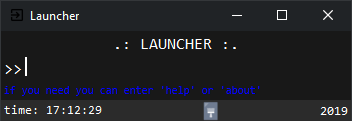

# launcher

## Description
Launcher vous permet de lancer vos applications et vos
sites web avec vos propre mots clés que vous pouvez personnaliser et configurer 
facilements

---

## Développement
- Python 3.6
- Tkinter (GUI)
- Json

## Outils utilisés
- Visual Studio Code

## Plateforme
- Windows

## Récupérer le code source
- Vous pouvez récupérer le code a tout moment:
> https://github.com/quentinhouillon/launcher_interface

## License
- Tous droits réservés

## Auteur
- w4rmux